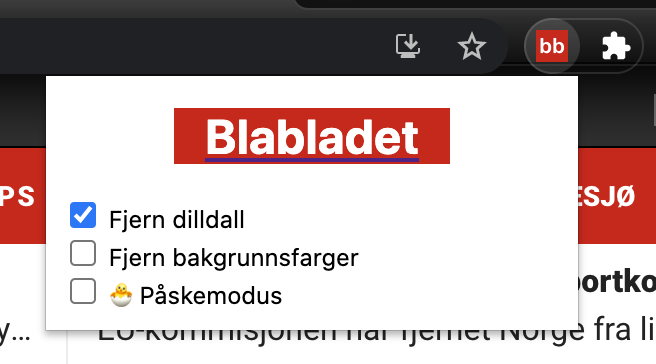

# Blabladet

[Chrome Extension](https://chrome.google.com/webstore/detail/blabladet/gffhghfcjpmgohnafihgfkifbamnpibe?hl=no)
 
 
 

Remember to check off what you want to change in the extension 
 
 
 
 
 

<h1>BEFORE AND AFTER:</h1>

### Known issues

- Code is violating dry principles
- Chrome api query/broadcasting is acting unstable.
- DOM manipulation happens before whole dom is loaded causing unmutated articls in bottom of page
